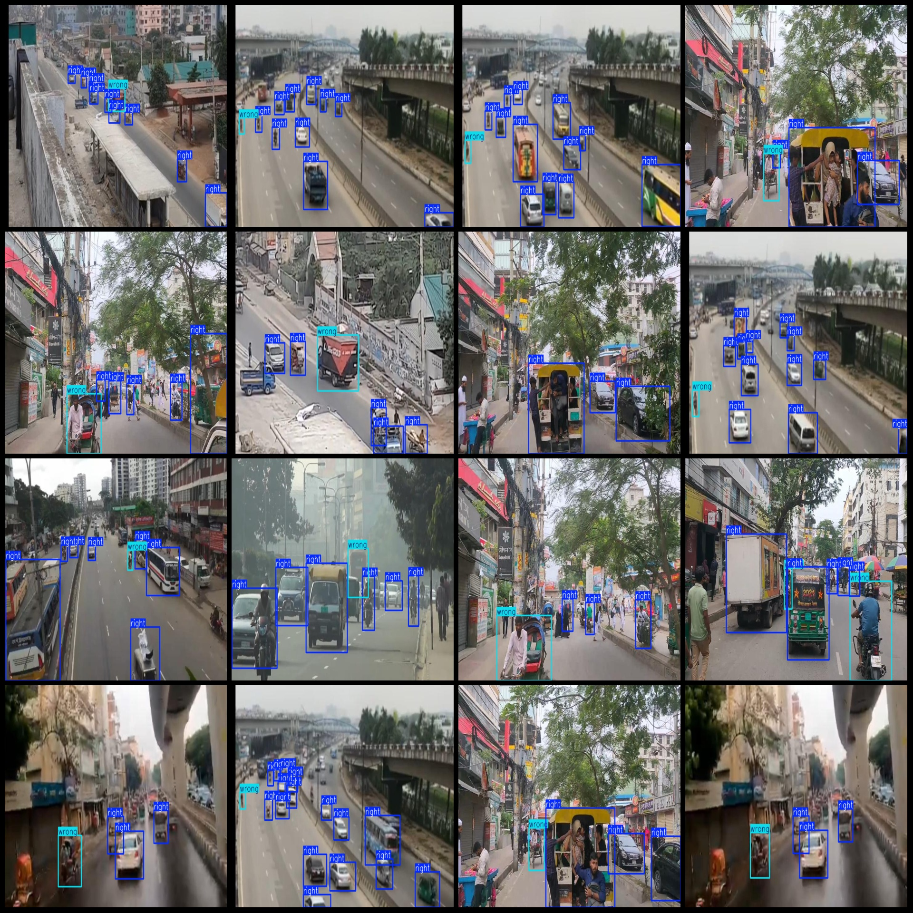
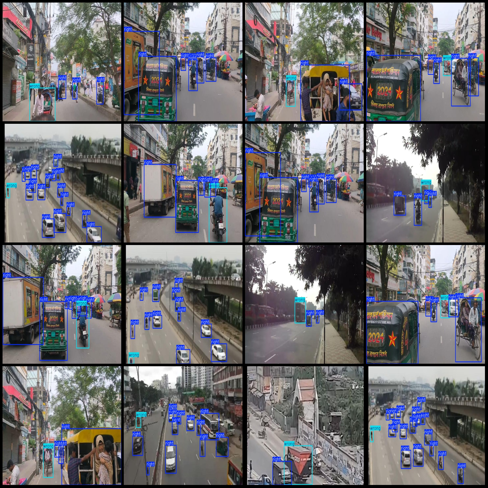

# Vehicle Reverse Driving Detection Dataset VOC+YOLO Format with 608 Entries in 2 Classes

Note: The dataset mainly consists of vehicles like cars, buses, motorcycles, and electric vehicles. There is no detailed subdivision of the vehicles; instead, they are simply labeled as whether they 
are reverse driving or not.

Dataset format: Pascal VOC format + YOLO format (without split paths in txt files, only including jpg images along with VOC format xml files and YOLO format txt files).
Number of images (jpg file count): 608
Number of annotations (xml file count): 608
Number of annotations (txt file count): 608
Number of annotation categories: 2
Annotation category names (note that the YOLO format category order does not correspond to this, but rather follows the labels folder 'classes.txt'): ["right", "wrong"]
Boxes per category:
Right boxes = 4371
Wrong boxes = 591
Total boxes = 4962
Number of images per box:
Right images = 608
Wrong images = 556
Image resolution: 720x480
Annotation tool used: labelImg
Annotation rules: Draw boxes around the category
Important note: The dataset does not have a division into training, validation, or test sets; you will need to divide it yourself.
Special declaration: This dataset does not guarantee any accuracy of the trained model or weight files.
Image preview:
Annotation example:

## Images

Here is a pay link on Stripe ( https://buy.stripe.com/3cs8yP7sY87d0vu9AB ). Please contact me lonlonago@foxmail.com after funding $89, and I will send you a complete data files , thank you!

